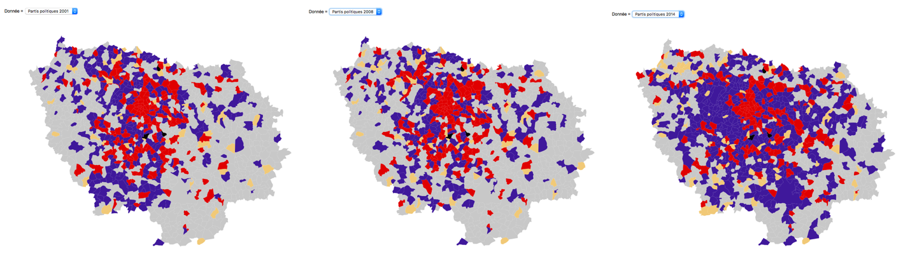
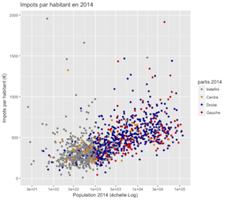
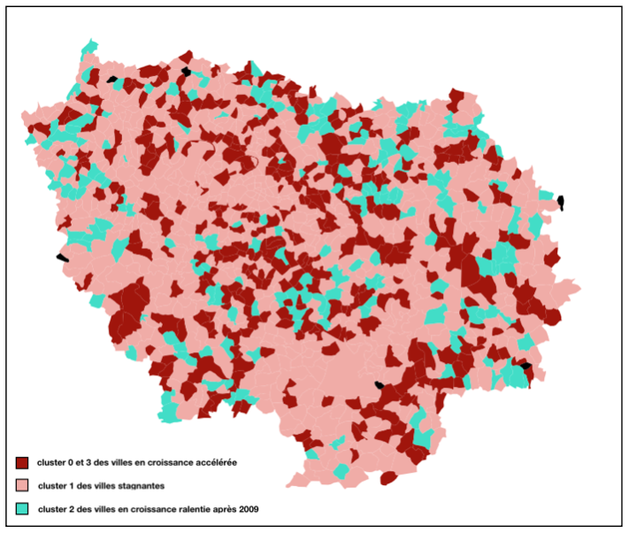
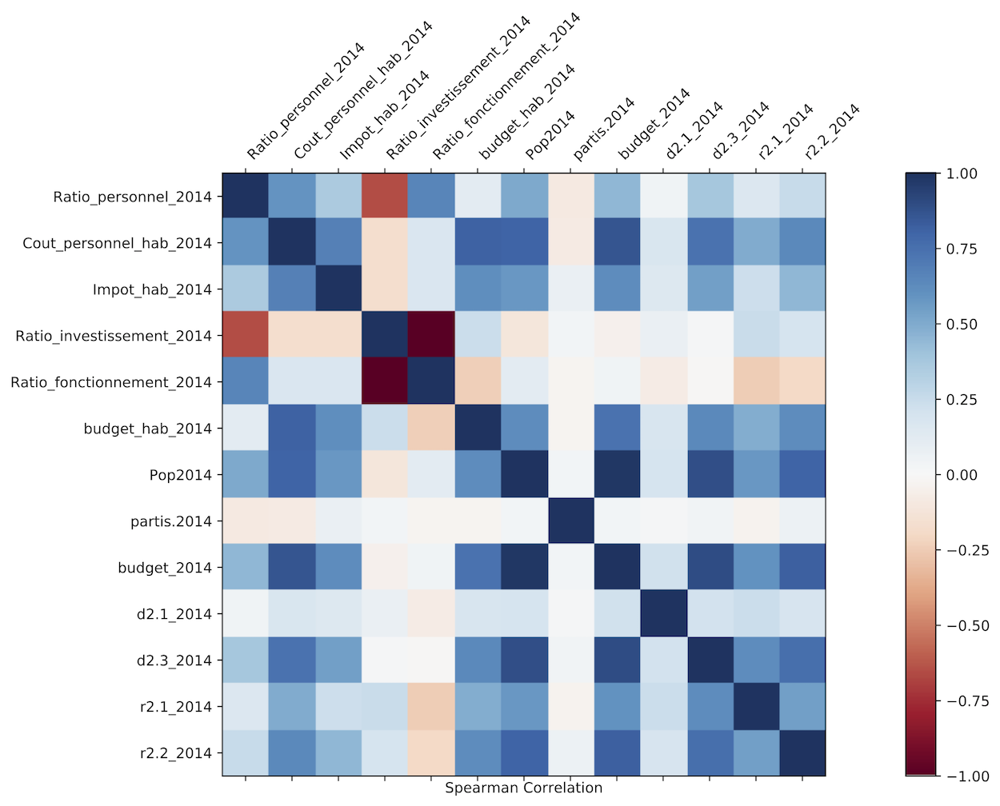

# Using Data to improve public policy in French cities

## Motivation 

Improving and optimizing public policy requires some wide and complex knowledge on the inteactions between decision and impact made in communities. The rise of data science and artificial intelligence opens new doors to this field by letting computers model these interactions and eventually help the decision-making process. But this is only possible with large amounts of data. 

In this project, we tackled this issue by building an extensive database for French cities, featuring data on demographics, economy, politics, education, housing and budgets. With this data, we were able to try out different analysis based on statistics and machine learning methods to gain insights on what data can tell about a city. 

Open Data for French communities is still at a very early stage, but new initiatives are being implemented. The website [DataGouv.fr](https://www.data.gouv.fr/fr/) serves as a platform for many public datasets. Also start-ups such as [Manty](https://manty.eu), which supervised our project, allow communities to build a model based on data to make wiser public policy decisions.

## Tools we used

* Web scraping : BeautifulSoup
* Parser for CSV 
* Data analysis : Pandas, R, scikit-learn
* Visualizations : R, d3.js 

## Some results and visualizations

* Complete and detailed budgets for all French cities displayed in an interactive interface [here](http://bl.ocks.org/clementruin/a4a5a4cf782e923198fcbd76304301ec)

* Evolution of political parties in the region of Paris

* Interactions between data features

## Acknowledgments

Special thanks to the team of [Manty](https://manty.eu) for providing us the framework of this project and guiding us throughout our research
